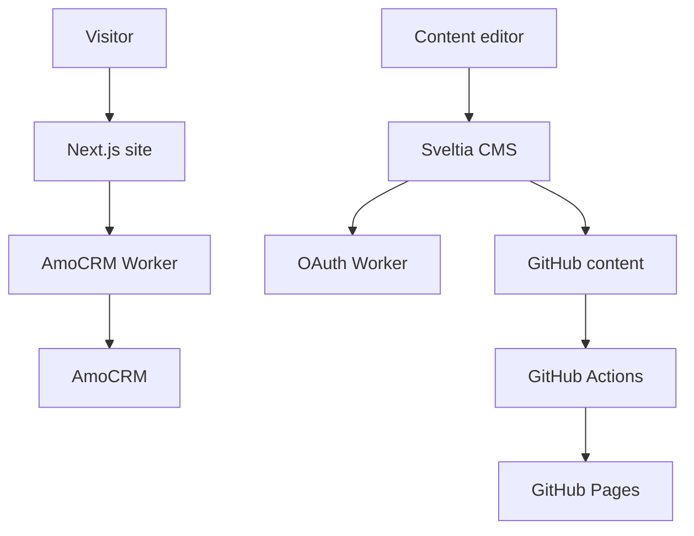

<div align="center">

# Послесловие · Posleslovie

<br>

[](https://posleslovie.online)
[](https://posleslovie.online/admin/)

<br>

[](https://github.com/kaliguri/Posleslovie/actions)


</div>

---

<details>
<summary><b>Screenshots</b></summary>

<br>


</details>

<details>
<summary><b>Architecture</b></summary>

<br>



</details>

---

## Русский

**Послесловие — production-ready сайт-лендинг для бренда натуральной косметики, который не требует платного хостинга:** инфраструктура на GitHub Pages + Cloudflare Workers, каталог, оформление заявки, CRM-интеграция и no-code редактирование контента без участия разработчика.

### Ключевые преимущества

- Без платного хостинга: прод-инфраструктура на GitHub Pages + Cloudflare Workers
- Статический экспорт Next.js с деплоем на GitHub Pages и custom domain (`posleslovie.online`)
- Редактируемый контент через Sveltia CMS (JSON-файлы в GitHub)
- Checkout-сценарий с сохранением состояния формы, валидацией, загрузкой логотипа и созданием лида в AmoCRM
- SEO-ready: sitemap, robots.txt, Open Graph, JSON-LD
- CI-пайплайн: format, lint, typecheck, unit tests, build и deploy

<details>
<summary><b>Для разработчиков</b></summary>

<br>

**Стек**

|            |                                                             |
| ---------- | ----------------------------------------------------------- |
| Frontend   | Next.js (static export), React, TypeScript, Tailwind CSS v4 |
| Контент    | JSON в `content/`, Sveltia CMS                              |
| Хостинг    | GitHub Pages + GitHub Actions                               |
| Интеграции | Cloudflare Workers (AmoCRM, CMS OAuth)                      |

**Структура**

```text
├── content/              # JSON-контент (редактируется через CMS)
│   ├── home-*.json       # Секции лендинга
│   ├── site-settings.json
│   ├── site-products.json
│   └── legal-documents.json
├── public/admin/         # Sveltia CMS
├── src/app/              # Next.js App Router (page, layout, robots, sitemap)
├── cloudflare/           # Workers: AmoCRM, CMS OAuth
└── .github/workflows/pages.yml
```

**Локальный запуск**

```bash
npm install
npm run dev    # http://localhost:3000
npm run check  # format + lint + typecheck
npm run build  # статическая сборка -> out/
```

**Карта архитектуры (current boundaries)**

```text
src/
├── app/                      # entry, page composition, metadata
├── widgets/
│   └── home-sections/
│       ├── ui/               # section-level UI modules (Hero, Process, WhyUs, ...)
│       └── model/            # content mapping + runtime schemas
├── features/
│   └── checkout/
│       ├── model/            # state, validation, payload contracts, API
│       └── ui/
│           ├── CheckoutModal.tsx         # thin orchestrator
│           └── checkout-modal/*          # stepper/forms/panels/legal/lead
└── shared/
    ├── ui/                   # reusable primitives
    ├── lib/                  # pure helpers (assetPath, city, phone, structured data)
    └── config/               # typed config backed by content JSON
```

**Демонстрация проекта**

1. `npm install`
2. `npm run dev` и открыть [http://localhost:3000](http://localhost:3000)
3. Ключевые сценарии:
   - CTA на Hero -> открывается модал оформления заказа
   - Мобильное меню -> кнопка оформления заказа
   - Модал «Для партнеров» -> форма отправки заявки
4. Перед демо клиенту:
   - `npm run check:full`

> Требуется Node.js 22+. Checkout и CMS-авторизация работают через внешние Cloudflare Workers.

**Деплой:** push в `main` -> GitHub Actions -> `out/` на GitHub Pages.  
**Настройка Pages:** `Settings -> Pages -> GitHub Actions`.

**Контент:** [posleslovie.online/admin/](https://posleslovie.online/admin/) -> GitHub -> Edit -> Publish (~3 мин).

**Интеграции**

| Сервис       | Назначение                                    |
| ------------ | --------------------------------------------- |
| AmoCRM       | Форма заказа -> сделка с заметкой и вложением |
| GitHub OAuth | Авторизация в Sveltia CMS                     |

Секреты интеграций (AmoCRM, OAuth) размещаются в Cloudflare Dashboard и не хранятся в репозитории.

</details>

---

## English

**Posleslovie is a production-ready landing website for a natural cosmetics brand that runs without paid hosting:** GitHub Pages + Cloudflare Workers infrastructure, product catalog, checkout lead capture, CRM integration, and no-code content editing without developer involvement.

### Highlights

- No paid hosting required: production infrastructure runs on GitHub Pages + Cloudflare Workers
- Static Next.js export deployed to GitHub Pages with custom domain
- Editable content via Sveltia CMS backed by JSON files in GitHub
- Checkout flow with persisted form state, validation, logo upload and AmoCRM lead creation
- SEO-ready: sitemap, robots.txt, Open Graph, JSON-LD
- CI pipeline: format, lint, typecheck, unit tests, build and deploy

<details>
<summary><b>For developers</b></summary>

<br>

**Stack**

|              |                                                             |
| ------------ | ----------------------------------------------------------- |
| Frontend     | Next.js (static export), React, TypeScript, Tailwind CSS v4 |
| Content      | JSON in `content/`, Sveltia CMS                             |
| Hosting      | GitHub Pages + GitHub Actions                               |
| Integrations | Cloudflare Workers (AmoCRM, CMS OAuth)                      |

**Structure**

```text
├── content/              # JSON content (edited via CMS)
│   ├── home-*.json       # Landing sections
│   ├── site-settings.json
│   ├── site-products.json
│   └── legal-documents.json
├── public/admin/         # Sveltia CMS
├── src/app/              # Next.js App Router (page, layout, robots, sitemap)
├── cloudflare/           # Workers: AmoCRM, CMS OAuth
└── .github/workflows/pages.yml
```

**Local development**

```bash
npm install
npm run dev    # http://localhost:3000
npm run check  # format + lint + typecheck
npm run build  # static build -> out/
```

**Architecture map (current boundaries)**

```text
src/
├── app/                      # entry, page composition, metadata
├── widgets/
│   └── home-sections/
│       ├── ui/               # section-level UI modules (Hero, Process, WhyUs, ...)
│       └── model/            # content mapping + runtime schemas
├── features/
│   └── checkout/
│       ├── model/            # state, validation, payload contracts, API
│       └── ui/
│           ├── CheckoutModal.tsx         # thin orchestrator
│           └── checkout-modal/*          # stepper/forms/panels/legal/lead
└── shared/
    ├── ui/                   # reusable primitives
    ├── lib/                  # pure helpers (assetPath, city, phone, structured data)
    └── config/               # typed config backed by content JSON
```

**How to demo project**

1. `npm install`
2. `npm run dev` and open [http://localhost:3000](http://localhost:3000)
3. Show key scenarios:
   - hero CTA -> checkout modal opens
   - mobile menu -> checkout action
   - partners modal -> lead submit flow
4. Before client demo run:
   - `npm run check:full`

> Node.js 22+ is required. Checkout and CMS auth are handled by external Cloudflare Workers.

**Deployment:** push to `main` -> GitHub Actions -> `out/` to GitHub Pages.  
**Pages setup:** `Settings -> Pages -> GitHub Actions`.

**Content:** [posleslovie.online/admin/](https://posleslovie.online/admin/) -> GitHub -> Edit -> Publish (~3 min).

**Integrations**

| Service      | Purpose                                        |
| ------------ | ---------------------------------------------- |
| AmoCRM       | Checkout form -> deal with note and attachment |
| GitHub OAuth | Sveltia CMS sign-in                            |

Integration secrets (AmoCRM and OAuth) are managed in the Cloudflare Dashboard and are not stored in the repository.

</details>

---

## License

> Status: production/demo portfolio repository. Public for code review; not intended as a reusable template.

This is a public portfolio repository for a private/commercial project.  
The code is provided for review only. Reuse, redistribution and commercial use are not allowed without permission.

See [`LICENSE.md`](LICENSE.md) for details.
