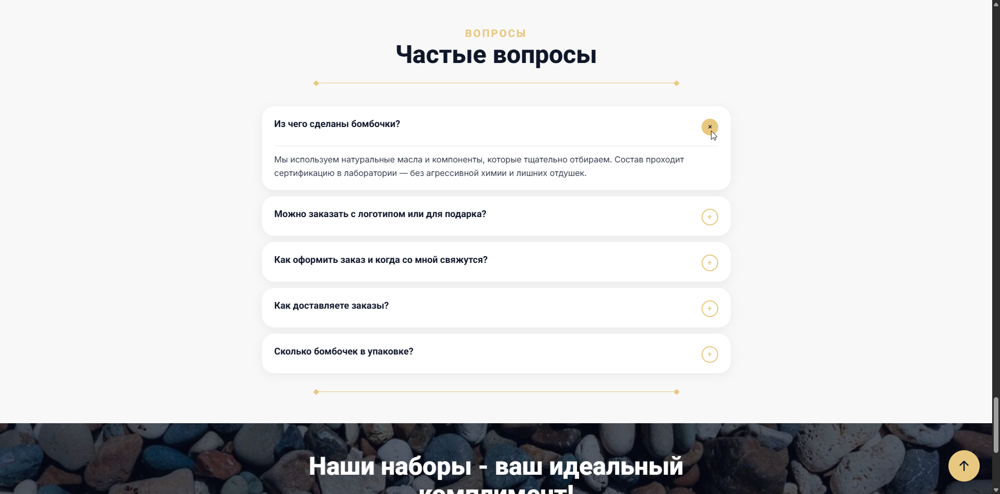
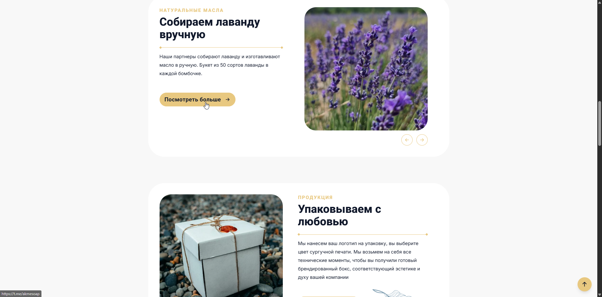
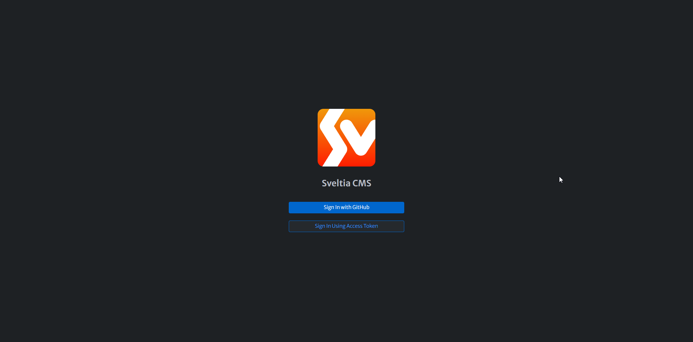
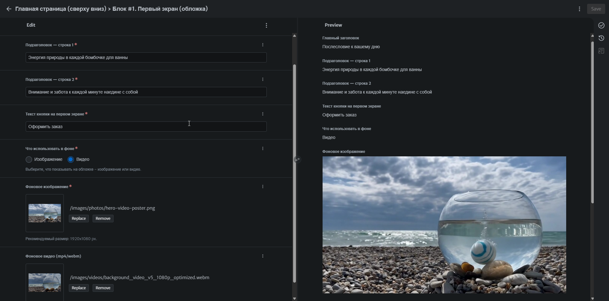
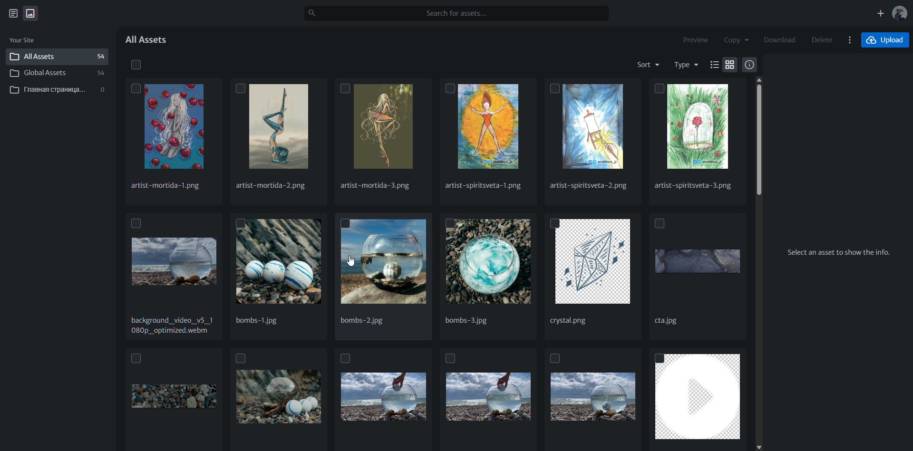
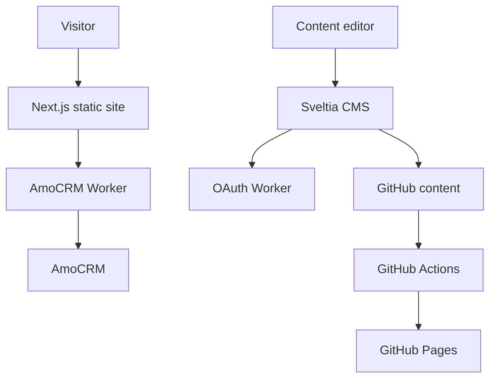

<!-- ============================================================
     README.md — single file, BILINGUAL via in-page anchors.
     EN block first (canonical), RU block below. Left-aligned.
     No AI information anywhere. Do NOT create README.ru.md.
     ============================================================ -->

<a id="top"></a>

<p>
  <a href="#english"><b>English</b></a>
  &nbsp;·&nbsp;
  <a href="#русский"><b>Русский</b></a>
  &nbsp;·&nbsp;
  <a href="#top"><b>[↑ Back to top / Наверх]</b></a>
</p>

# Posleslovie · Послесловие

> Production landing site for a natural-cosmetics gift brand — running on $0 hosting, editable without a developer.

<p>
  <a href="https://github.com/Kaliguri/Posleslovie/actions"></a>
  
  
  
  
  
  
</p>

|                   |                                                                                                                                                                                                                                                                                                                                                                                                                                                                                                                   |
| ----------------- | ----------------------------------------------------------------------------------------------------------------------------------------------------------------------------------------------------------------------------------------------------------------------------------------------------------------------------------------------------------------------------------------------------------------------------------------------------------------------------------------------------------------- |
| **Frontend**      |     |
| **Content & CMS** | <a href="https://github.com/sveltia/sveltia-cms"></a> <a href="https://zod.dev"></a>                                                                                                                   |
| **Hosting**       |                                                                                                                                   |
| **Integrations**  | <a href="https://workers.cloudflare.com"></a>                                                                                            |
| **Tooling**       |                         |
| **Architecture**  |                                                                                                                                                                 |

<p>
  <a href="https://posleslovie.online"><b>▶ Open the site</b></a>
  &nbsp;·&nbsp;
  <a href="https://posleslovie.online/admin/"><b>🛠 CMS admin panel</b></a>
</p>

---

<details>
<summary><b>📸 Screenshots</b></summary>

<br>

**Website**

<details>
<summary>Hero screen</summary>


</details>

<details>
<summary>FAQ section</summary>



</details>

<details>
<summary>Process section</summary>



</details>

**CMS (Sveltia)**

<details>
<summary>Sign-in</summary>



</details>

<details>
<summary>Editor with live preview</summary>



</details>

<details>
<summary>Media library</summary>



</details>

</details>

---

## English

**Posleslovie is a production landing site for a natural-cosmetics gift brand (handmade bath bombs and gift sets).** The whole thing runs without paid hosting — a static Next.js export on GitHub Pages, with Cloudflare Workers handling the few dynamic pieces. The brand owner edits every section of the page through a no-code CMS, and customer checkout requests flow straight into the CRM, all without a developer in the loop.

> **What this project demonstrates:** building a real, client-facing site on $0 production infrastructure (GitHub Pages + Cloudflare Workers), with schema-validated CMS content, SEO and structured data, a multi-step checkout integrated with a CRM, and a CI pipeline that gates every deploy.

### Key features

| Feature                         | Description                                                                                                                                                                        |
| ------------------------------- | ---------------------------------------------------------------------------------------------------------------------------------------------------------------------------------- |
| **Zero paid hosting**           | Static Next.js export on GitHub Pages + free Cloudflare Workers — the live site costs nothing to run.                                                                              |
| **No-code content editing**     | The brand owner edits every landing section via Sveltia CMS; content lives as JSON in the repo, validated with Zod so a bad edit degrades gracefully instead of breaking the page. |
| **Checkout → CRM**              | A multi-step checkout modal with persisted form state, validation, and logo upload, creating a lead in AmoCRM through a secret-bearing Cloudflare Worker.                          |
| **SEO-ready**                   | Sitemap, robots.txt, Open Graph, and JSON-LD structured data generated at build time.                                                                                              |
| **CI before deploy**            | Every push to `main` runs format, lint, typecheck and unit tests before building and publishing to Pages.                                                                          |
| **Feature-Sliced architecture** | `app / widgets / features / shared` layers with a clean `model` ↔ `ui` split.                                                                                                      |

---

## Русский

> Продакшен-лендинг для бренда натуральной косметики — работает на бесплатном хостинге и редактируется без разработчика.

**Послесловие — это продакшен-лендинг для бренда натуральной косметики (ручные бомбочки для ванны и подарочные наборы).** Сайт работает без платного хостинга: статический экспорт Next.js на GitHub Pages, а немногочисленные динамические части обслуживают Cloudflare Workers. Владелица бренда редактирует каждую секцию страницы через no-code CMS, а заявки из оформления заказа уходят напрямую в CRM — всё без участия разработчика.

> **Что демонстрирует проект:** реальный клиентский сайт на бесплатной (zero-cost) инфраструктуре (GitHub Pages + Cloudflare Workers), с контентом из CMS под валидацией схемой, SEO и структурированными данными, многошаговым оформлением заказа с интеграцией в CRM и CI-пайплайном, который проверяет каждый деплой.

### Ключевые возможности

| Возможность                    | Описание                                                                                                                                                                                    |
| ------------------------------ | ------------------------------------------------------------------------------------------------------------------------------------------------------------------------------------------- |
| **Без платного хостинга**      | Статический экспорт Next.js на GitHub Pages + бесплатные Cloudflare Workers — живой сайт ничего не стоит в обслуживании.                                                                    |
| **No-code редактирование**     | Владелица бренда правит каждую секцию через Sveltia CMS; контент хранится как JSON в репозитории и валидируется через Zod (Zod) — ошибочная правка деградирует мягко, а не ломает страницу. |
| **Оформление заказа → CRM**    | Многошаговый модал оформления с сохранением состояния формы, валидацией и загрузкой логотипа; создаёт лид в AmoCRM через Cloudflare Worker, который хранит секреты.                         |
| **Готовность к SEO**           | Sitemap, robots.txt, Open Graph и структурированные данные JSON-LD генерируются на этапе сборки.                                                                                            |
| **CI перед деплоем**           | Каждый push в `main` прогоняет format, lint, typecheck и unit-тесты до сборки и публикации на Pages.                                                                                        |
| **Архитектура Feature-Sliced** | Слои `app / widgets / features / shared` с чистым разделением `model` ↔ `ui`.                                                                                                               |

---

<details id="for-developers">
<summary><b>For developers</b></summary>

<br>

### Tech stack

|                  |                                                                      |
| ---------------- | -------------------------------------------------------------------- |
| **Frontend**     | Next.js 16 (static export), React 19, TypeScript, Tailwind CSS v4    |
| **Content**      | JSON files in `content/`, edited via Sveltia CMS, validated with Zod |
| **Hosting**      | GitHub Pages + GitHub Actions (custom domain `posleslovie.online`)   |
| **Integrations** | Cloudflare Workers — AmoCRM lead proxy, Sveltia CMS GitHub OAuth     |
| **Tooling**      | ESLint, Prettier, Vitest (unit), Playwright (e2e)                    |

### Project layout

```text
├── content/                  # JSON content (edited via CMS, validated with Zod)
│   ├── home-*.json           # Landing sections (hero, about, why-us, process, faq, reviews…)
│   ├── site-settings.json
│   ├── site-products.json
│   └── legal-documents.json
├── public/admin/             # Sveltia CMS
├── src/
│   ├── app/                  # Next.js App Router: page, layout, robots, sitemap
│   ├── widgets/
│   │   └── home-sections/
│   │       ├── ui/           # section-level modules (Hero, Process, WhyUs, FAQ, Reviews…)
│   │       └── model/        # content mapping + runtime schemas (content-schema.ts)
│   ├── features/
│   │   └── checkout/
│   │       ├── model/        # state, validation, payload contracts, API
│   │       └── ui/           # CheckoutModal.tsx (thin orchestrator) + checkout-modal/*
│   └── shared/
│       ├── ui/               # reusable primitives
│       ├── lib/              # pure helpers (assetPath, city, phone, structured data)
│       └── config/           # typed config backed by content JSON
├── cloudflare/               # Workers: AmoCRM proxy, CMS OAuth
└── .github/workflows/pages.yml
```

### Local development

```bash
npm install
npm run dev      # http://localhost:3000
npm run check    # format:check + lint + typecheck + unit tests
npm run build    # static build -> out/
npm run check:full   # check + Playwright e2e (run before a client demo)
```

> Node.js 22+ is required. Checkout and CMS auth are handled by external Cloudflare Workers; their secrets (AmoCRM, OAuth) live in the Cloudflare Dashboard, not in the repo.

### CI/CD

- **Deploy:** push to `main` → GitHub Actions runs `npm run check`, builds the static export, and publishes `out/` to GitHub Pages.
- **Pages setup:** `Settings → Pages → GitHub Actions`.
- **Content publishing:** edit at [posleslovie.online/admin/](https://posleslovie.online/admin/) → commit to GitHub → Actions redeploys (~3 min).

### Integrations

| Service      | Purpose                                                                      |
| ------------ | ---------------------------------------------------------------------------- |
| AmoCRM       | Checkout form → deal with note and attachment, via a Cloudflare Worker proxy |
| GitHub OAuth | Sveltia CMS sign-in, via a CSRF-protected Cloudflare Worker                  |

### Architecture map



</details>

---

## License

© 2026 Max Gaida. All rights reserved.

This repository is public for portfolio and demonstration purposes only. It was
built as a commercial project for the "Posleslovie" brand; all brand assets and
content belong to their respective owner. No license is granted to use, copy,
modify, or distribute any part of it without prior written permission.

See [LICENSE.md](LICENSE.md) for details.
