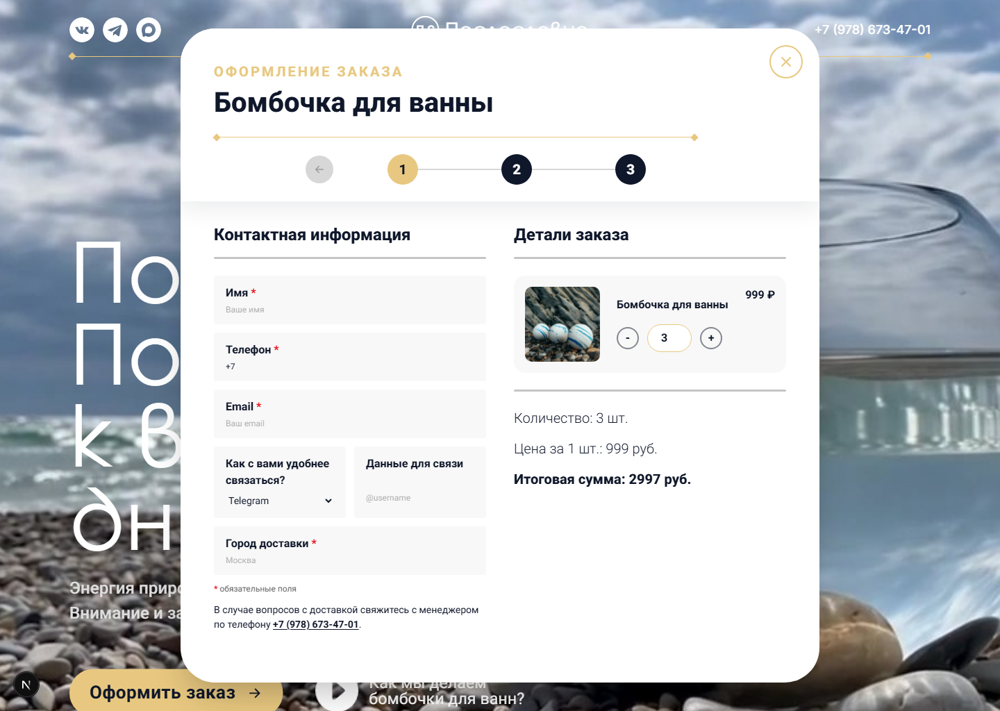
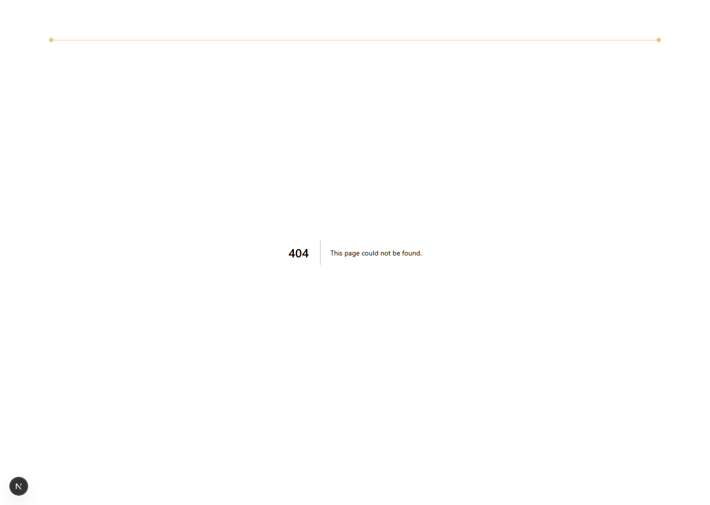
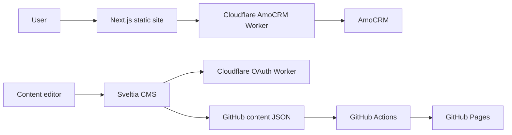

<div align="center">

# Послесловие · Posleslovie

<br>

[](https://posleslovie.online)
[](https://posleslovie.online/admin/)

<br>

[](https://github.com/kaliguri/Posleslovie/actions)


</div>

---

## Русский

**Сайт-витрина для бренда натуральных бомбочек** — с онлайн-заказом, интеграцией CRM и управлением контентом без разработчика.

### Что умеет

- **Адаптивный дизайн** — отлично смотрится на телефоне, планшете и большом экране
- **Заказ в пару кликов** — форма для частных клиентов и корпоративных заказов: загрузка логотипа, автодополнение города, сохранение данных
- **Заявки прямо в CRM** — каждая форма создаёт сделку в AmoCRM с запиской, суммой и вложениями. Ничего не теряется
- **Контент без программиста** — встроенная CMS: открыл браузер, поправил текст или фото, нажал «Опубликовать» — изменения живые через ~3 минуты
- **Быстрый и бесплатный хостинг** — статический сайт на GitHub Pages, без своего сервера
- **SEO из коробки** — sitemap, robots.txt, Open Graph (красивые превью в мессенджерах), JSON-LD для Google
- **Обновляется само** — любой коммит в `main` запускает сборку и деплой автоматически

## Screenshots





## Architecture



<details>
<summary><b>Для разработчиков</b></summary>

<br>

**Стек**

|            |                                                             |
| ---------- | ----------------------------------------------------------- |
| Frontend   | Next.js (static export), React, TypeScript, Tailwind CSS v4 |
| Контент    | JSON в `content/`, Sveltia CMS                              |
| Хостинг    | GitHub Pages + GitHub Actions                               |
| Интеграции | Cloudflare Workers — AmoCRM, CMS OAuth                      |

**Структура**

```
├── content/              # JSON-контент (редактируется через CMS)
│   ├── home-*.json       # Секции лендинга
│   ├── site-settings.json
│   ├── site-products.json
│   └── legal-documents.json
├── public/admin/         # Sveltia CMS
├── src/app/              # Next.js App Router (page, layout, robots, sitemap)
├── cloudflare/           # Workers: AmoCRM, CMS OAuth
└── .github/workflows/pages.yml
```

**Локально**

```bash
npm install
npm run dev    # http://localhost:3000
npm run build  # статическая сборка → out/
```

> Node.js 22+. Checkout и CMS-авторизация работают через внешние Cloudflare Workers.

**Деплой:** push в `main` → GitHub Actions → `out/` на GitHub Pages.
Настройка: **Settings → Pages → GitHub Actions**.

**Контент:** [posleslovie.online/admin/](https://posleslovie.online/admin/) → GitHub → Edit → Publish (~3 мин).
Подробнее: [`docs/decap-cms-auth-setup.md`](docs/decap-cms-auth-setup.md)

**Интеграции**

| Сервис       | Назначение                                   |
| ------------ | -------------------------------------------- |
| AmoCRM       | Форма заказа → сделка с заметкой и вложением |
| GitHub OAuth | Авторизация в Sveltia CMS                    |

Секреты (токены AmoCRM, OAuth) — в Cloudflare Dashboard, не в репозитории.

</details>

---

## English

**A brand site for natural bath bombs** — with an ordering flow, CRM integration, and no-code content management.

### What it does

- **Responsive design** — looks great on any device
- **Simple ordering** — personal and corporate checkout: logo upload, city autocomplete, form persistence
- **Orders straight to CRM** — every submission creates an AmoCRM deal with a note, total, and attachments
- **No-code content editing** — built-in CMS: edit text or photos in the browser, click Publish, live in ~3 min
- **Fast & free hosting** — static site on GitHub Pages, no server needed
- **SEO out of the box** — sitemap, robots.txt, Open Graph, JSON-LD for Google
- **Self-deploying** — any commit to `main` triggers an automatic build and deploy

<details>
<summary><b>For developers</b></summary>

<br>

**Stack**

|              |                                                             |
| ------------ | ----------------------------------------------------------- |
| Frontend     | Next.js (static export), React, TypeScript, Tailwind CSS v4 |
| Content      | JSON in `content/`, Sveltia CMS                             |
| Hosting      | GitHub Pages + GitHub Actions                               |
| Integrations | Cloudflare Workers — AmoCRM, CMS OAuth                      |

**Structure**

```
├── content/              # JSON content (edited via CMS)
│   ├── home-*.json       # Landing sections
│   ├── site-settings.json
│   ├── site-products.json
│   └── legal-documents.json
├── public/admin/         # Sveltia CMS
├── src/app/              # Next.js App Router (page, layout, robots, sitemap)
├── cloudflare/           # Workers: AmoCRM, CMS OAuth
└── .github/workflows/pages.yml
```

**Local development**

```bash
npm install
npm run dev    # http://localhost:3000
npm run build  # static build → out/
```

> Node.js 22+. Checkout and CMS auth run on external Cloudflare Workers.

**Deployment:** push to `main` → GitHub Actions → `out/` to GitHub Pages.
Setup: **Settings → Pages → GitHub Actions**.

**Content:** [posleslovie.online/admin/](https://posleslovie.online/admin/) → GitHub → Edit → Publish (~3 min).
Details: [`docs/decap-cms-auth-setup.md`](docs/decap-cms-auth-setup.md)

**Integrations**

| Service      | Purpose                                       |
| ------------ | --------------------------------------------- |
| AmoCRM       | Checkout form → deal with note and attachment |
| GitHub OAuth | Sveltia CMS sign-in                           |

Secrets (AmoCRM tokens, OAuth credentials) live in the Cloudflare Dashboard only — never in the repo.

</details>

---

<div align="center">

_Private project · All rights reserved_

</div>
